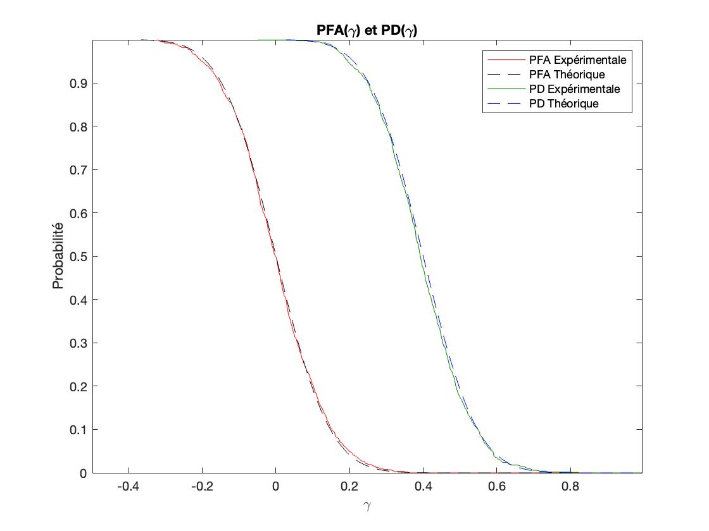

<h1>Detection of a constant signal in presence of noise</h1>

Two detection problems are solved in this repository: first, a detector is implemented in order to distinguish a constant signal A (known) in presence of gaussian noise (with a known standard deviation). After that, A and the noise standard deviation are considered as unknowns and another detector is programmed. This work was done using MATLAB in the context of the Master SISEA.

